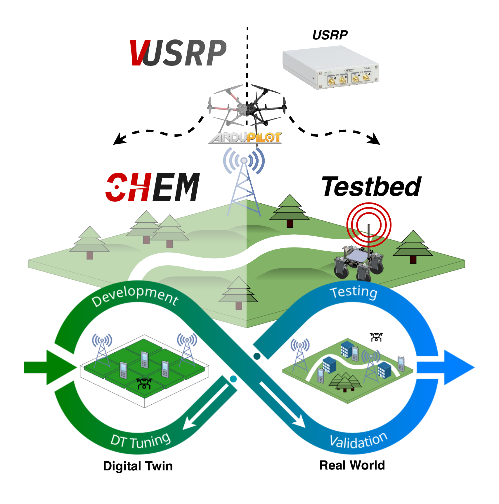
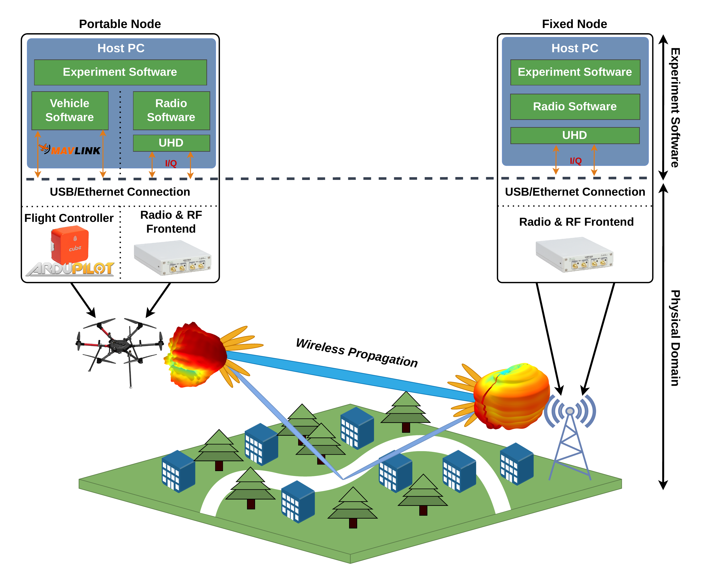
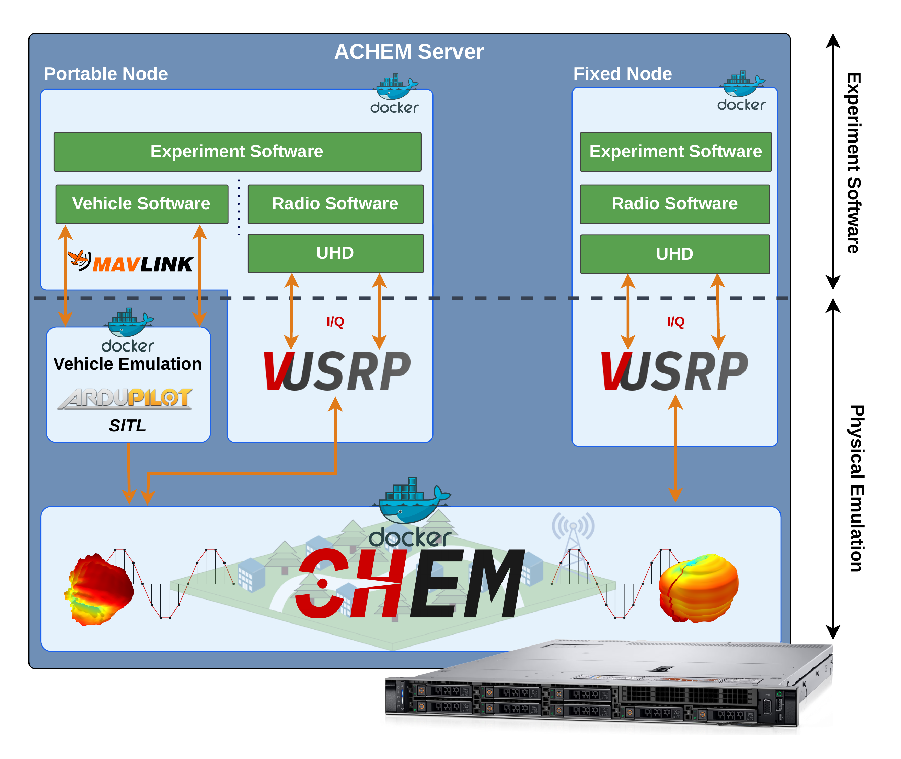

# Digital Twins

ACHEM enables wireless digital twins: fully software based replicas of real USRP testbeds that run unmodified application software against emulated channels and radios.

*The digital twin (left) with virtualized components replicates a real communication network (right).*

### Sample Scenario

Consider a sample end to end USRP based experiment with two USRPs and two host PCs, where one node is mobile (carried by a UAV) and the other is fixed on a tower. Each experiment node consists of a host PC and a USRP radio. Nodes run experiment software (e.g., srsRAN, GNU Radio) that communicates with the USRPs through the UHD driver; the vehicle for the mobile node is controlled by dedicated vehicle control software.

*A real testbed setup with a UAV carrying a portable node and a fixed node, each with a USRP device.*

This sample scenario can be seamlessly transitioned into a digital twin by using the ACHEM environment **without modifying the experiment software**. Portability of USRP application software is achieved by introducing [V-USRP](vusrp.md), which allows existing USRP software to run unaltered within the ACHEM environment.

*Equivalent setup with V-USRP and CHEM, with a portable node and a fixed node.*

## Workflow

The digital twin workflow follows four phases:

1. **Development**: build and iterate on wireless applications using standard UHD based tools, entirely in software.
2. **Testing**: run end to end experiments in the emulated environment with realistic channel conditions and mobility.
3. **DT Tuning**: adjust channel models, antenna patterns, and propagation parameters in the digital twin to match a target real world deployment.
4. **Validation**: compare digital twin results against real testbed measurements to confirm fidelity.

This cycle allows researchers to develop and validate wireless systems rapidly without requiring access to physical hardware or testbed sites.

## Containerization

In ACHEM, experiment software from all nodes can run together on the same computer, either on bare metal or with virtualization technology. Docker containers are used to provide logical separation while minimizing virtualization overhead. Each node (application software and its corresponding V-USRP instance) is executed inside a Docker container. The containerized environment also facilitates the transition of ACHEM based experiments into a real testbed by moving Docker containers.

Node mobility is supported by a vehicle emulator; ACHEM coordinates both the V-USRP instances and the ArduPilot SITL instances (one per vehicle) corresponding to each physical node.

## Related Pages

1. [Overview](overview.md): Overall ACHEM architecture.
2. [V-USRP](vusrp.md): Virtual radio emulation.
3. [CHEM](chem.md): Channel emulator internals.
4. [PyCHEM](pychem.md): Management and control interface.
