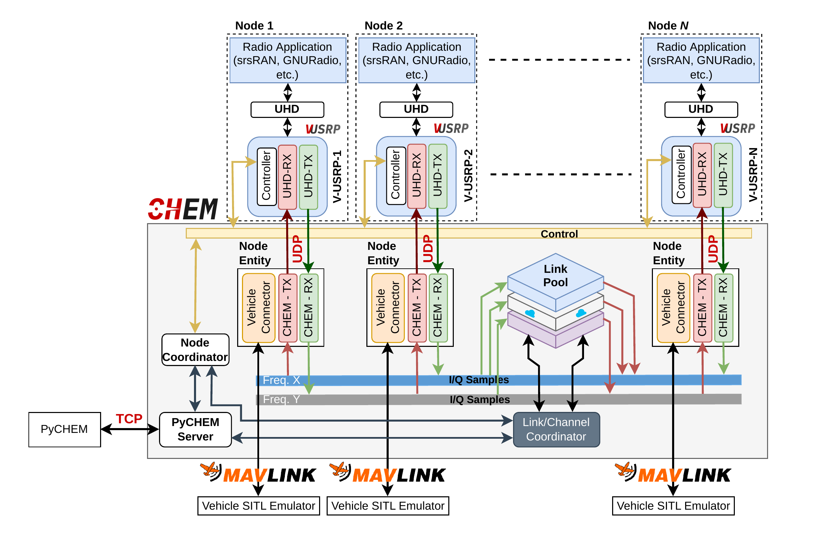
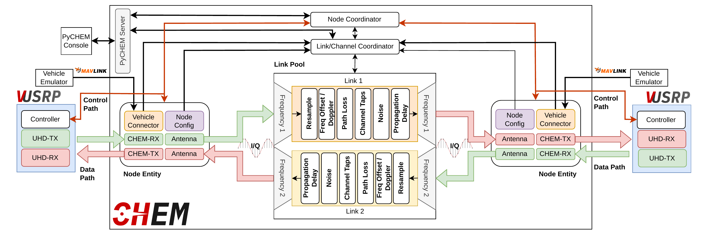

# Overview

This overview describes ACHEM as a digital twin framework that emulates wireless channels and radios with two unique components: **CHEM** and **V-USRP**. CHEM is the digital counterpart of real world wireless propagation and V-USRP corresponds to the USRP device. CHEM emulates the wireless channel at the I/Q level in real time, making it protocol agnostic and allowing it to operate without application software changes.

## Overall Architecture

The overall architecture and interconnections of CHEM and V-USRP are shown below. CHEM provides orchestration for the nodes, wireless channels, and node mobility. A single CHEM instance is used for an arbitrary number of V-USRP instances. This configuration allows nodes within an environment to operate synchronously at the same center frequency or at different center frequencies, supporting both TDD and FDD configurations.

*Overall ACHEM architecture and V-USRP/CHEM integration. N nodes transmit and receive concurrently on two frequencies in this example.*

Similar to the way a USRP transfers signals between radio application software and the real world, the V-USRP couples the application software and CHEM. Each V-USRP has three components working in parallel that communicate separately with CHEM:

1. **Controller**: handles configuration and control path coordination with CHEM.
2. **UHD TX**: transmits I/Q samples from the application to CHEM via UDP.
3. **UHD RX**: receives processed I/Q samples from CHEM via UDP.

## Detailed Architecture

The detailed internal structure of CHEM is shown below. CHEM comprises multiple components that replicate real world hardware entities in the digital domain while preserving the integrity of system components. CHEM is written in C++ and all data path processing is implemented with SIMD instructions to maintain low latency across the system.

*CHEM internal architecture and flow of the wireless emulation for two V-USRP instances on different uplink and downlink frequencies with a single RX and TX stream each.*

## Components

### Node Entity

CHEM assigns a Node Entity to each registered V-USRP, including CHEM TX, CHEM RX, and a Vehicle Connector (if the node is mobile). The data path of V-USRP is used to exchange I/Q samples between the Node Entity and its corresponding V-USRP. The control path is shared between V-USRP instances and is used for coordinating V-USRP operation. See [CHEM](chem.md) for details on the connection process.

### Node Coordinator

The Node Coordinator handles new V-USRP registration, updates of node information, channel requests, and detachment. It uses a TCP server to receive JSON based control requests from V-USRP instances. Node Entities are created by the Node Coordinator and their management is also handled by the Node Coordinator.

### Link or Channel Coordinator

The Link or Channel Coordinator is responsible for creating and destroying virtual wireless channels and links for frequencies where at least a transmitting and a receiving V-USRP are tuned. Created channels are allocated in the Link Pool and the Link or Channel Coordinator chooses the respective channel for each stream based on the center frequency of the stream.

### Link Pool

The Link Pool manages all active channels. Each channel executes a DSP pipeline for every source destination link, including resampling, CIR convolution, path loss, noise injection, antenna gain, and frequency or Doppler offset. See [CHEM: Channel Intermediates](chem.md#channel%2Dintermediates) for the full pipeline description.

### PyCHEM Connector

The PyCHEM Connector handles communications with the [PyCHEM](pychem.md) library or user interface and forwards the requested changes to both the Node Coordinator and Link or Channel Coordinator. Through PyCHEM, an experimenter can configure and update channel and node level parameters at runtime.

## Signal Model

For each TX/RX node pair on a channel, I/Q processing starts with the retrieval of CHEM RX receiver and CHEM TX transmitter information including mobility (if present). For each pair, Angle of Arrival (AoA), Angle of Departure (AoD), and path loss are calculated. I/Q samples are resampled if required, transmitter antenna gain is applied according to the AoD, and then frequency offset, path loss, channel taps, noise, and propagation delay are applied.

The per receiver baseband signal model used by CHEM is:

$$
y_r[n] = \sum_{t \in \mathcal{T}_r} G^{\text{tx}}_{t,r}[n] \cdot a_{t,r}[n] \cdot \sum_{\ell=0}^{L_{t,r}−1} h_{t,r,\ell}[n] \cdot G^{\text{tx}}_{t,r}[n] \cdot x_t[n − d_{t,r}[n] − \ell] \cdot e^{j\omega_{t,r}n} + w_r[n]
$$

where:

1. $x_t[n]$ and $y_r[n]$ are transmitted and received complex baseband samples.
2. $h_{t,r,\ell}[n]$ is tap $\ell$ of the time varying CIR between transmitter $t$ and receiver $r$.
3. $a_{t,r}[n]$ is the path loss attenuation.
4. $d_{t,r}[n]$ is the propagation delay in samples.
5. $\omega_{t,r} = 2\pi \Delta f_{t,r} T_s$ is the discrete time frequency offset.
6. $G^{\text{tx}}_{t,r}[n]$ and $G^{\text{rx}}_{t,r}[n]$ are antenna gains from AoD and AoA.
7. $w_r[n]$ is additive noise.

Receiver antenna gains (from AoAs) are applied before each processed I/Q frame is enqueued in the corresponding CHEM TX buffer. Each processed signal frame is distributed to CHEM TX transmitters and sent to V-USRP receivers (UHD RX) in parallel.

## Related Pages

1. [CHEM](chem.md): Channel emulator internals and configuration.
2. [V-USRP](vusrp.md): Virtual radio peripheral.
3. [PyCHEM](pychem.md): Python management interface.
5. [Channel Models](channel%2Dmodels.md): Propagation models and equations.
