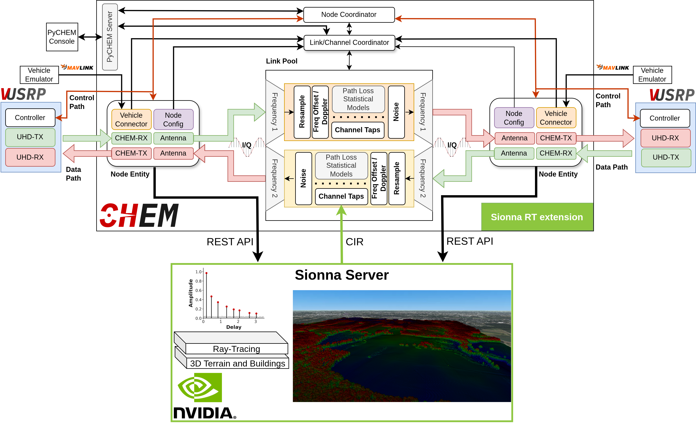

# Sionna RT Extension

CHEM integrates with the [AERPAW Sionna RT Extension](https://github.com/AERPAW/AERPAW-DT-SIONNA-EXTENSION) to replace its built-in propagation models with GPU-accelerated ray tracing powered by [Sionna RT](https://nvlabs.github.io/sionna/).

Sionna is a built-in [CHEM extension](extensions.md). It declares `bypassesPathLoss() = true`, meaning it replaces CHEM's statistical propagation models (FSPL, Two-Ray, 3GPP, etc.) with ray traced channel impulse responses. The propagation loss is encoded directly in the CIR taps computed by the ray tracer.


*CHEM internal architecture with the Sionna RT extension. The Sionna server performs GPU-accelerated ray tracing over 3D terrain and buildings, replacing CHEM's built-in statistical propagation models with ray-traced channel impulse responses.*

## How It Works

When Sionna is enabled, CHEM runs a background thread that continuously synchronizes node positions and channel impulse responses between CHEM and the Sionna RT server.

### Startup

1. CHEM reads the `extensions.sionna` block from `config.json`.
2. If `enabled` is `true`, the extension is started automatically at startup. It can also be started at runtime via the `EXT` command or PyCHEM.
3. The extension creates a scene on the Sionna server via `POST /scenes`, providing the `referenceOrigin` (GPS lat/lon/alt) that the server uses as the local coordinate system origin.
4. Scene creation is retried every 2 seconds until the server responds.

### Poll Loop

The client runs a poll loop at the configured `updateRateMs` interval (minimum 50ms):

**1. Position Sync** (`syncPositions`):

- Iterates over all CHEM nodes that have reported locations.
- Each node is registered on the Sionna server as both a transmitter (`{name}-tx`) and a receiver (`{name}-rx`). Sionna requires unique names across TX and RX within a scene.
- Position updates are cached; only nodes whose coordinates have changed since the last sync are updated via `PUT`.

**2. CIR Computation** (`computeAndApplyCIR`):

This step is skipped if any of the following are true:

- No scene has been created yet.
- Fewer than 1 TX or 1 RX is registered on the Sionna server.
- No `Intermediate` has active channel links (i.e., no two nodes share a frequency).

When active:

- Requests the server to compute propagation paths via `POST /scenes/{id}/simulation/paths` with the configured `maxDepth` and `numSamples` ray samples.
- Fetches the resulting Channel Impulse Response via `GET /scenes/{id}/simulation/cir`.
- Parses the multi-dimensional CIR arrays (delays and complex gains) for each TX-RX pair.
- Converts per-path delays and gains into FIR filter taps via `cirToTaps()`, capped at `cir_max_taps`.
- Applies the taps to the corresponding `Channel` in each `Intermediate` via `updateCIR()`.
- Self-links (same physical node as both TX and RX) are automatically skipped.

When Sionna CIR is active on a channel, the statistical propagation models are not evaluated. The ray-traced CIR taps provide the propagation loss directly.

## CIR Data Format

The Sionna server returns CIR data with the following structure:

| Field | Shape | Description |
|---|---|---|
| `delays` | `[num_rx][num_tx][num_paths]` | Per-path propagation delays in seconds |
| `gains.real` | `[num_rx][num_rx_ant][num_tx][num_tx_ant][num_paths][num_time_steps]` | Real part of complex path gains |
| `gains.imag` | same as `gains.real` | Imaginary part of complex path gains |
| `shape` | object | Dimension metadata (`num_rx`, `num_tx`, `num_paths`, etc.) |

### CIR to FIR Tap Conversion

The `cirToTaps()` function converts the raw CIR (per-path delays and complex gains) into a discrete FIR tap vector suitable for convolution with IQ samples:

1. Each path delay is quantized to the nearest sample index at the channel's sample rate.
2. Complex gains for paths that map to the same tap index are accumulated (summed).
3. The resulting tap vector length equals `max_tap_index + 1`, capped by `cir_max_taps` (default 64).

## Configuration

Add the `sionna` block under `extensions` in your CHEM `config.json`:

```json
{
  "extensions": {
    "sionna": {
      "enabled": true,
      "serverUrl": "http://192.168.8.173:8000",
      "updateRateMs": 500,
      "maxDepth": 3,
      "numSamples": 100000,
      "referenceOrigin": {
        "lat": 35.7272,
        "lon": -78.6960,
        "alt": 0.0
      }
    }
  }
}
```

| Key | Type | Default | Description |
|---|---|---|---|
| `enabled` | boolean | `false` | Enable automatic Sionna client startup |
| `serverUrl` | string | `"http://localhost:8000"` | URL of the Sionna RT server |
| `updateRateMs` | integer | `500` | Poll interval in milliseconds (minimum 50) |
| `maxDepth` | integer | `3` | Maximum ray tracing depth (reflections/diffractions) |
| `numSamples` | integer | `100000` | Number of ray samples per path computation (minimum 1000) |
| `referenceOrigin.lat` | float | `35.7272` | Latitude of the scene coordinate origin |
| `referenceOrigin.lon` | float | `-78.6960` | Longitude of the scene coordinate origin |
| `referenceOrigin.alt` | float | `0.0` | Altitude of the scene coordinate origin (meters) |

## Sionna Server Setup

The Sionna RT Extension runs as a Docker container with GPU access:

```bash
git clone https://github.com/AERPAW/AERPAW-DT-SIONNA-EXTENSION.git
cd AERPAW-DT-SIONNA-EXTENSION
docker compose up --build
```

**Requirements:**

- NVIDIA GPU with CUDA support
- Docker with `nvidia-container-toolkit` installed
- The server listens on port 8000 by default

### Server API Endpoints

| Method | Endpoint | Description |
|---|---|---|
| `POST` | `/scenes` | Create a new scene with optional origin, scene path |
| `GET` | `/scenes/{id}` | Get scene info (object count, TX/RX count, origin) |
| `POST` | `/scenes/{id}/transmitters` | Register a transmitter (name, position, power) |
| `POST` | `/scenes/{id}/receivers` | Register a receiver (name, position) |
| `PUT` | `/scenes/{id}/transmitters/{name}` | Update transmitter position |
| `PUT` | `/scenes/{id}/receivers/{name}` | Update receiver position |
| `POST` | `/scenes/{id}/simulation/paths` | Compute propagation paths (max_depth, num_samples) |
| `GET` | `/scenes/{id}/simulation/cir` | Retrieve the computed CIR |

## Runtime control

Sionna supports the following actions via the `EXT` command:

| Action | Description |
|---|---|
| `start` | Start the extension with the provided config params |
| `stop` | Stop the extension and clear CIR state |
| `status` | Return current running state, server URL, scene ID |
| `config` | Update `updateRateMs`, `maxDepth`, and/or `numSamples` at runtime |

Example:

```json
{"CMD": "EXT", "extension": "sionna", "action": "start", "params": {
    "serverUrl": "http://192.168.8.173:8000",
    "referenceOrigin": {"lat": 35.7272, "lon": -78.6960, "alt": 0.0},
    "updateRateMs": 200, "maxDepth": 3, "numSamples": 100000
}}
```

## Source files

| File | Description |
|---|---|
| `extensions/sionna/include/sionna_client.h` | `SionnaExtension` class declaration |
| `extensions/sionna/src/sionna_client.cpp` | Extension implementation (HTTP, sync, CIR parsing) |
| `include/chem/extensions/extension.h` | `ChannelExtension` base class |
| `src/chem/channel/coordinator.cpp` | Extension registration and `EXT`/`EXT_LIST` command routing |
