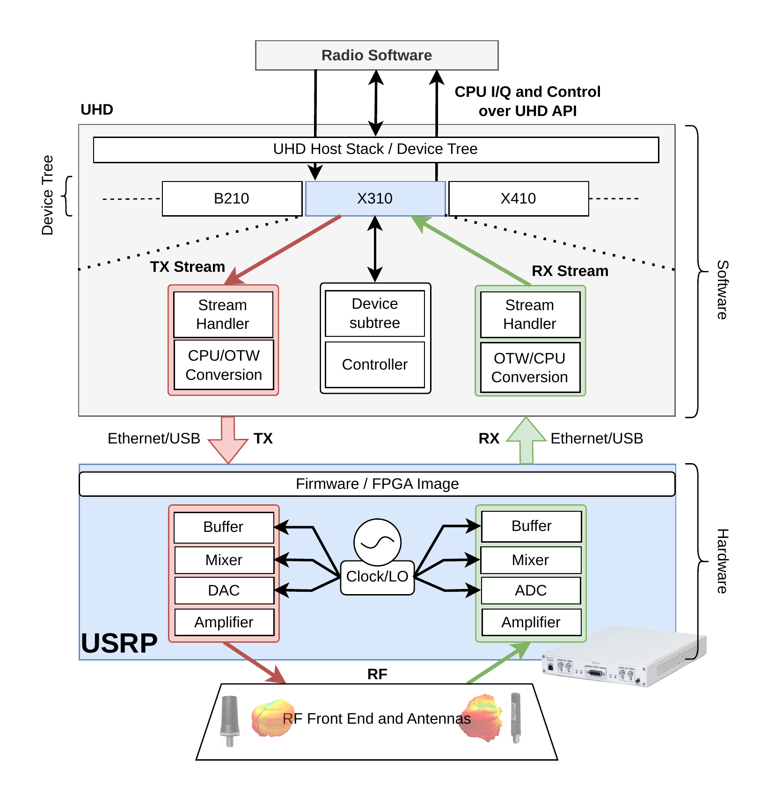
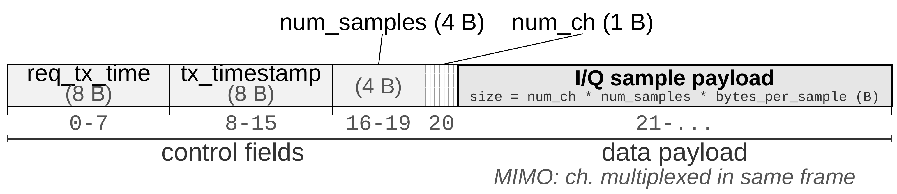
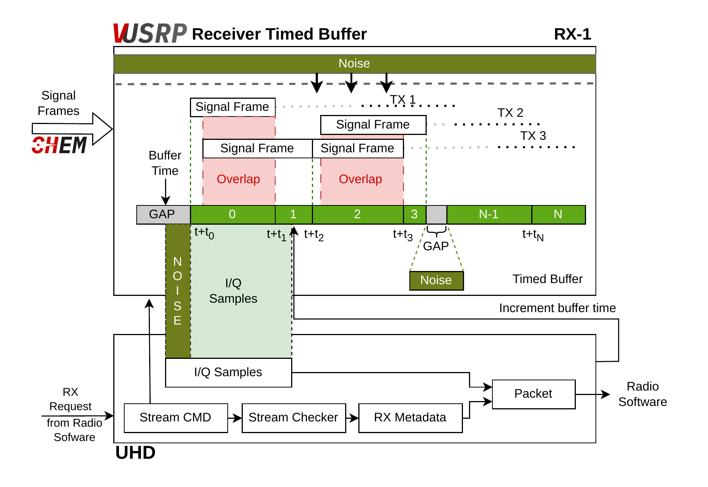

V-USRP (Virtual Universal Software Radio Peripheral) is a virtual radio device developed by forking the open source [UHD driver](https://github.com/EttusResearch/uhd) and creating a new device type within it. The V-USRP emulates real USRP hardware, allowing applications that use UHD to run within the ACHEM emulation environment the same way as on USRP hardware.

## Architecture

A typical hardware USRP communicates with the host PC through Ethernet or USB. The V-USRP uses network interfaces, specifically UDP sockets, for the same purpose.
A V-USRP instance exposes the same basic stream interface to UHD applications while redirecting radio traffic through CHEM.

<figure markdown="span">

<figcaption>Experimental setup with a real USRP device (X310).</figcaption>
</figure>
<figure markdown="span">

<figcaption>Equivalent setup with V USRP and CHEM.</figcaption>
</figure>

Key V-USRP software components include:

1. **TX Metadata**: handles transmit scheduling and timing semantics.
2. **Scheduler**: evaluates transmit requests against the virtual hardware clock.
3. **CPU/OTW Conversion**: converts I/Q samples between CPU format and Over the Wire format in both directions.
4. **Signal Frame Generator**: packages I/Q samples with control fields for network transport.
5. **TX UDP Client**: sends signal frames to CHEM.
6. **Virtual Clock**: provides emulated hardware time with 1 ns resolution.
7. **I/Q Sample Retriever**: fetches processed samples from the timed buffer.
8. **Timed Buffer**: aligns and superposes incoming frames from multiple transmitters.
9. **RX UDP Server**: receives processed signal frames from CHEM.
10. **V-USRP Controller**: coordinates registration and control path communication with CHEM.

## Data Exchange

Once initialization is complete, V-USRP exchanges signal frames with CHEM over UDP. The sections below follow that runtime path from frame construction to transmit scheduling and receive delivery.

### Signal Frame

The data exchanged between V-USRP and CHEM is encapsulated in a **signal frame** that includes I/Q samples as well as several control fields.

*Signal frame structure for data exchange between V USRP and CHEM.*

The signal frame fields are:

<table>
  <thead>
    <tr>
      <th>Field</th>
      <th>Size</th>
      <th>Description</th>
    </tr>
  </thead>
  <tbody>
    <tr>
      <td><code>req_tx_time</code></td>
      <td>8 B</td>
      <td>Emulated transmit time used to place the frame on the radio timeline. For scheduled transmissions, this is the transmit time from UHD metadata; for unscheduled transmissions, V-USRP assigns the next available instant.</td>
    </tr>
    <tr>
      <td><code>tx_timestamp</code></td>
      <td>8 B</td>
      <td>Actual transmission time from the emulation host clock, used for computing propagation delay.</td>
    </tr>
    <tr>
      <td><code>num_samples</code></td>
      <td>4 B</td>
      <td>Number of samples in the frame.</td>
    </tr>
    <tr>
      <td><code>num_ch</code></td>
      <td>1 B</td>
      <td>Number of MIMO channels multiplexed in the frame.</td>
    </tr>
    <tr>
      <td><strong>I/Q sample payload</strong></td>
      <td>variable</td>
      <td><code>size = num_ch * num_samples * bytes_per_sample</code>. Samples from MIMO channels are multiplexed in the same frame to maintain temporal alignment.</td>
    </tr>
  </tbody>
</table>

Signal frame size is determined by the sampling rate and number of channels, configured by the application software through the UHD API. Before transmission over the network, the frame is fragmented into multiple UDP packets based on the MTU and reassembled at the receiver. This custom fragmentation avoids IP level fragmentation overhead and complete frame drops.

### Transmit Path

The V-USRP transmitter employs a TX UDP client to send I/Q samples, encapsulated as signal frames, from the V-USRP to CHEM. A UDP client is initialized when the application software creates a TX stream. CHEM activates channel processing only when at least one receiver is associated with that frequency; otherwise, samples on that channel are not processed.

The UHD API provides two transmission modes:

1. **Scheduled**: TX metadata includes an explicit hardware transmit time, and frames are inserted into the FIFO accordingly. V USRP evaluates each transmit request against the virtual hardware clock. If the scheduled frame specifies a transmit time earlier than the current virtual hardware time, the request is marked *late* and discarded. An *underflow/underrun* condition is treated separately and corresponds to the transmitter not being able to sustain continuous sample delivery.
2. **Unscheduled**: TX metadata does not carry a requested transmit time; each frame is appended to a FIFO and assigned the next available transmission instant. Following the first unscheduled call, subsequent calls are serialized at the end of the previous transmission.

If the application produces samples excessively ahead of consumption , subsequent UHD calls are blocked to emulate hardware backpressure.

### Receive Path

A V-USRP receiver is instantiated when a USRP application requests an RX stream through the UHD API. Receive processing is organized in two stages.

V-USRP supports real time signal superposition, combining multiple transmitted signals at each receiver to accurately emulate shared medium wireless behavior.

### Stage 1: Timed Buffer

In the first stage, a **timed buffer** aligns and superposes incoming frames. A receiving V-USRP may observe partially overlapping frames from multiple transmitting V-USRPs when transmitter(s) operate on the same frequency. Each incoming frame is inserted according to its emulated transmit time: non overlapping frames are delivered at scheduled receive times as buffer time advances, whereas overlapping frames are combined by **sample wise summation** over the overlap interval. The timed buffer is implemented as a priority queue (based on time information) to maintain low latency and overhead during real time operation.

*The timed buffer data structure superposes signal frames from different nodes arriving at different times and delivers them to the application software as requested.*

### Stage 2: Sample Delivery

The second stage is triggered when application software requests samples with RX metadata. Consistent with transmission, reception supports unscheduled and scheduled modes (UHD has more stream modes. We've abstracted as unscheduled and scheduled to make it easy to understand):

1. **Unscheduled**: provides continuous sample delivery.
2. **Scheduled**: returns samples at a specified hardware time, a requirement for scheduled communication stacks such as LTE and 5G.

The receive behavior of a real USRP is replicated using a virtual hardware time, $T_{vusrp}$, which preserves stream continuity and annotates returned samples with reception timestamps. As in real hardware buffering, samples must be consumed to avoid *overflow*; overflow results in lost samples and gaps in the stream. If no transmitter contributes samples within a requested time window, noise only samples are returned to the application.

## Hardware Time and Clock

In V-USRP, time is calculated based on the emulation computer clock; the V-USRP internal clock starts at the initialization of UHD. The assumption is that all V-USRPs in a scenario run on the same emulating computer (and are thus precisely synchronized). The time resolution of V-USRP is **1 ns**. In the current implementation, this constrains the maximum supported sample rate to 1 GSamples/s. Time resolution limits on real USRPs are imposed by the master clock rate.

## Configuration Flow

During initialization, application software may create multiple TX and RX streams depending on application requirements. A stream includes properties such as sampling rate, center frequency, data format, transmit or receive type, and special commands. V-USRP can be configured with tool called `vusrp_configure` as shown below.

## Related Pages

1. [Overview](overview.md): Overall ACHEM system design.
2. [CHEM](chem.md): Channel emulator internals.
